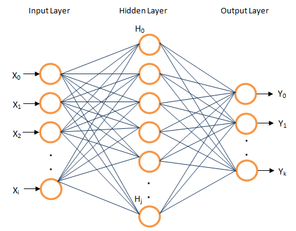

# Neural Networks
Neural networks are computational models inspired by the human brain. They consist of layers of interconnected nodes, or "neurons," each layer designed to perform specific types of transformations on its input data. Typically, a neural network includes:

**Input Layer:** This is the first point of data entry, where each node represents one feature of the input data.

**Hidden Layers:** These layers perform complex transformations on the input data using weights and activation functions. Deeper networks with more hidden layers can learn more complex patterns.

**Output Layer:** The final layer produces the network's output, such as a classification or prediction.
 

The power of neural networks lies in their ability to learn the appropriate transformation weights through a process called "training," often using backpropagation and gradient descent algorithms. This enables them to make predictions or recognize patterns in unseen data, making them highly effective for tasks like image and speech recognition, and in your case, audio data classification.

# Audio Data Classification Assignment USING NN

## Overview
This assignment's focus is on implementing neural networks to model audio data that you created previously. This follows our previous exploration of classical machine learning models.

## Tutorial Recap
In our last tutorial, we explored the basics of machine learning and supervised learning and performed classification using Random Forest, SVM and KNN. 

## Assignment Tasks

### Tasks
1. Fork the repository to your own account, create a new branch in it. 
2. Perform audio data classification utilizing neural network model on the combined dataset (created in the second assignment). 
3. Commit the final changes.
4. Merge into your main branch.
5. Create a detailed 1–2-page report (500-1000 words) on the modeling you've undertaken and your results. Compare differences in performance, accuracy, and computational efficiency between neural networks and classical approaches, and provide insights into why these differences occur. As well as compare the performance of our model(trained on combined dataset) with the  model accuracy we saw in tutorial(using only RAVDESS),
6. In your report, illustrate the comparsions via graphs. 
7. Upload your report on Canvas in PDF format, along with the Jupyter Notebook file. This will provide a comprehensive overview of your exploration and application of various techniques in audio data classification modeling. 

## Contact
For queries or further discussions, feel free to reach out to TA( maryiam_zahoor@sfu.ca)

Credits: https://github.com/IliaZenkov/sklearn-audio-classification 
